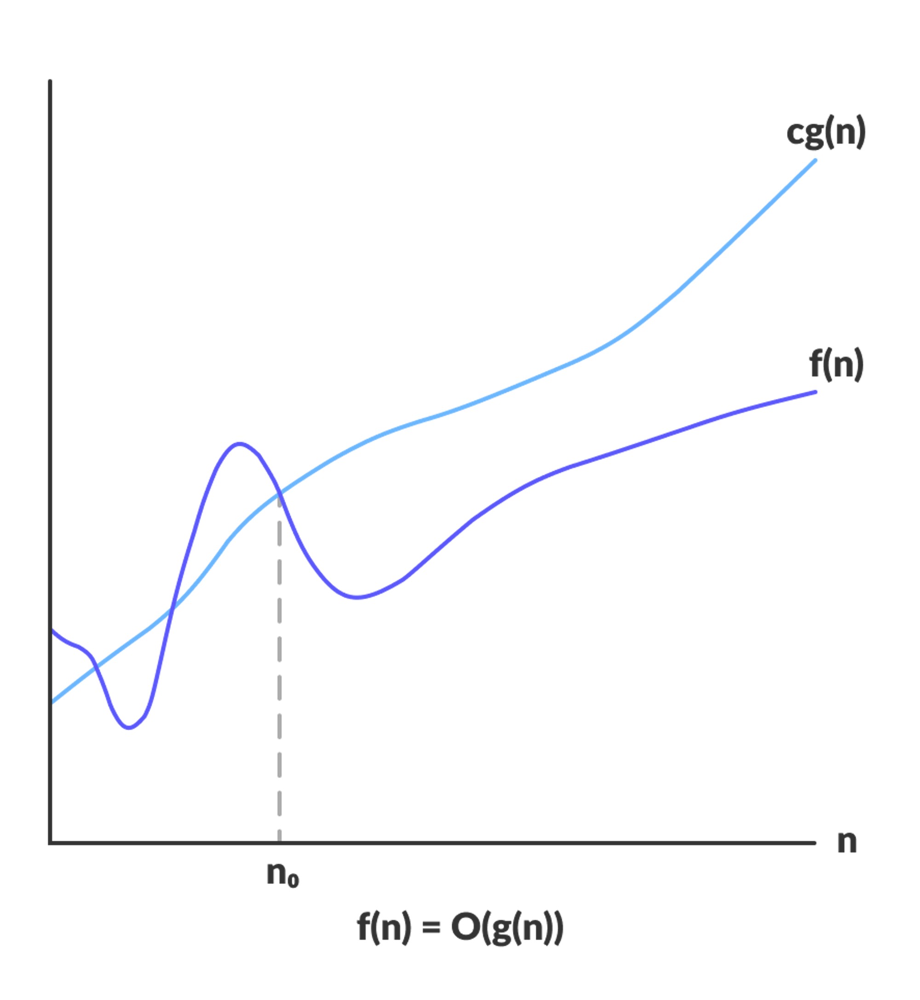
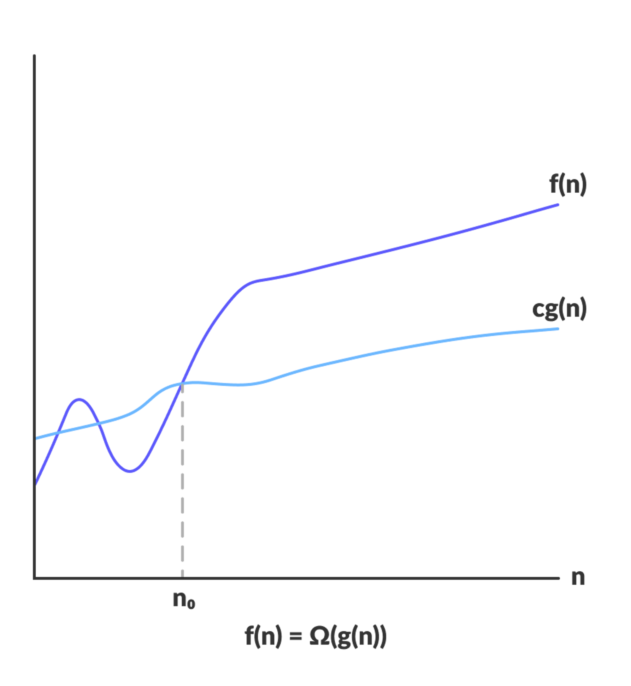
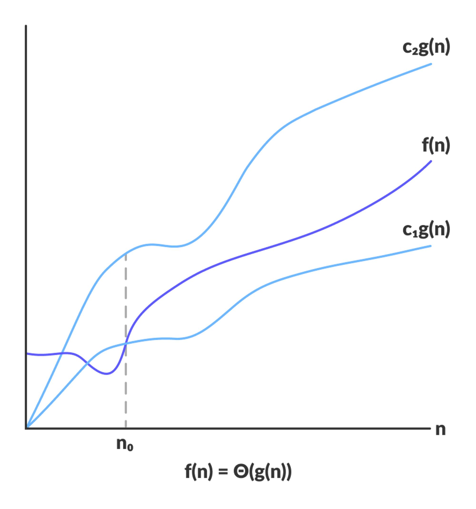

# Complexity Analysis

**Complexity analysis** is a fundamental concept in computer science that involves assessing the efficiency of algorithms in terms of their resource usage, such as time and space. It helps in understanding how an algorithm's performance scales with increasing input size.

There are two primary aspects of complexity analysis:

1. **Time Complexity:** This measures the amount of time an algorithm takes to run as a function of the length of its input. Time complexity is often expressed using **Big O notation**, which provides an upper bound on the growth rate of the algorithm's running time. Common time complexities include `O(1)` (**constant time**), `O(log n)` (**logarithmic time**), `O(n)` (**linear time**), `O(n log n)` (**linearithmic time**), `O(n^2)` (**quadratic time**), `O(2^n)` (**exponential time**), etc.

2. **Space Complexity:** This measures the amount of memory an algorithm uses as a function of the length of its input. Space complexity is also expressed using **Big O notation**. It describes the maximum amount of memory required by the algorithm at any point during its execution, not necessarily the total memory used. Common space complexities include `O(1)` (**constant space**), `O(n)` (**linear space**), `O(n^2)` (**quadratic space**), etc.

### Asymptotic Notations
Asymptotic notations are the mathematical notations used to describe the running time of an algorithm when the input tends towards a particular value or a limiting value.

There are mainly three asymptotic notations:
1. **Big-O notation**
2. **Omega notation**
3. **Theta notation**

#### Big-O Notation
Big-O notation represents the upper bound of the running time of an algorithm. Thus, it gives the worst-case complexity of an algorithm.



We say, a function `f(n)` is `O(g(n))` if there exists a constant `𝑐 > 0`and a value **𝑛<sub>0</sub>** (usually some threshold) such that for all `n` greater than **𝑛<sub>0</sub>**, the value of f(n) is bounded above by `c⋅g(n)`.

- `f(n) = O(g(n))`, if and only if there exists a **c > 0** and **n<sub>0</sub> > 0** such that **f(n) < c.g(n)** forever **n > n<sub>0</sub>**.

Example:
- f(n) = n<sup>2</sup>  + 5n - 6
- g(n) = 2n<sup>2</sup>
- c.g(n) - f(n) > 0
- 2n<sup>2</sup> - (n<sup>2</sup>  + 5n - 6) > 0
- n<sup>2</sup>  - 5n + 6 > 0
- (n - 2)(n - 3) > 0
- So g(n) ≥ f(n)  n ≥ 3  (Solved using quadratic equation)
- So there exists, c = 2 and  = 3 such that f(n) ≤ c * g(n) for all n ≥ 
- So f(n) = O(g(n))

#### Omega Notation
Omega notation represents the lower bound of the running time of an algorithm. Thus, it provides the best case complexity of an algorithm.
```       
Ω(g(n)) = { f(n): there exist positive constants c and n0
            such that 0 ≤ cg(n) ≤ f(n) for all n ≥ n0 }
```


For example, f(n) = n^2 and g(n) = n + 10

#### Theta Notation
Theta notation encloses the function from above and below. Since it represents the upper and the lower bound of the running time of an algorithm, it is used for analyzing the average-case complexity of an algorithm.

```
Θ(g(n)) = { f(n): there exist positive constants c1, c2 and n0
            such that 0 ≤ c1g(n) ≤ f(n) ≤ c2g(n) for all n ≥ n0 }
```



### Problems
1. Analyse the complexity for the following code
    ``` js
    for(let i=0; i<k; i++) {
        for(let j=0; j<k; j++) {
            console.log(i + " " + j);
        }
    }
    ```
    **Solution:** O(n<sup>2</sup>)
    -  First, we need to generate a function f(n) that returns the time taken to execute for any input n.
    - For a given n, the outer loop of i runs for 0 to n-1.
    - For each value of i, the inner loop runs again for 0 to n-1
    - So for each i, the inner loop runs n times.
    - Total complexity = n + n + n + …. + n (n times as i runs for n times)
    - f(n) = n ^ 2
    - So T.C = O(k^2)

2. Analyse the complexity for the following code
    ``` js
    for(let i=0; i<k; i++) {
        for(let j=0; j<=i; j++) {
            console.log(i + " " + j);
        }
    }
    ```
    **Solution:** O(n<sup>2</sup>)
    - For a given i, j runs from 0 to i
    - For i = 0: j only runs 1 time
    - For i = 1: j runs 2 times
    - For i = 2: j runs 3 times
    - For i = 3: j runs 4 times
    - and so on
    - For any general i = k: j runs for 0, 1, 2, …, k so k times
    
    - So total complexity = 1 + 2 + 3 + …. + n = 
    - Complexity: O(k^2)

3. Analyse the complexity for the following code
    ``` js
    for(let i=1; i<n; i *= 2) {
        console.log(i);
    }
    ```
    **Solution:** O(log<sub>2</sub>n)
    - Let’s see how i runs
    - i = 1, 2, 4, 8, 16, …, x, where x is the highest power of 2 less than n. 
    - Let’s say x = , then So how many steps? 
    - Step 0: i = 2 ^ 0
    - Step 1: i = 2 ^ 1
    - Step 2: i = 2 ^ 2
    - Step 3: i = 2 ^ 3
    - ..
    - Step p: i = 2 ^ p >= x
 
    - But what is p? 

    - Complexity: O(log<sub>2</sub>n)

4. Analyse the complexity for the following code
    ``` js
    for(let i=1; i<n; i++) {
        for(let j=1; j<n; j+=i) {
            console.log(i + " " + j);
        }
    }
    ```
    **Solution:** O(nlogn)
    - For i = 1, j runs n times (as it is same as j += 1)
    - For i = 2, j runs n/2 times (as j += 2)
    - For i = 3, j runs n/3 times
    - For general i = k, j runs n / k times
 
    - n + n/2 + n/3 + n/4 + …. + n/k +.. + 1
    - n (1 + 1/2 + 1/3 + … 1/n)
 
    - Now we need to find the complexity of: 
 
    - What is Big - O? We need to find g(n) which is greater than f(n) 
    - We round each number k, down to its nearest power of 2 less than equal to k
    - i.e 3 can be rounded down to 2, 4 can be rounded down to 4, 5 can be rounded down to 4
 
    - Obviously, k > 2 ^ p, where 2 ^ p is the nearest power of 2 less than equal to k
 
    - So total complexity: O(n * logn)

  
### Some Popular Complexities
1. **O(1)**: Constant Time Complexity.
    - Example: a + b, a % b

2. **O(logn)**: Logarithmic Complexity.
    - Example: Binary Search

3. **O(√n)**: Example: Finding divisors of a number
 
4. **O(n)**: Linear time complexity. 
    - Example: Linear search, finding maximum element
 
5. **O(n * logn)**: loglinear complexity.
    - Example: Sorting, Seive of Eratosthenes
 
6. **O(n<sup>2</sup>)**: Quadratic complexity. 
    - Example: Insertion sort
 
7. **O(n<sup>3</sup>)**: Cubic complexity. 
    - Example: Floyd Warshall algorithm
 
8. **O(2<sup>n</sup>)**: Exponential complexity. 
    - Example: bitmasking

### Master Theorem
The **Master Theorem** is a handy tool in algorithm analysis, particularly in the context of **divide-and-conquer algorithms**. It provides a straightforward way to analyze the time complexity of **recursive algorithms** that follow a specific form.

The theorem states that if you have a recurrence relation of the form:
    **T(n) = aT(n/b) + f(n)**
where:
- **T(n)** is the time complexity of the algorithm
- **a** is the number of subproblems generated in each recursion.
- **b** is the factor by which the problem size is reduced in each recursion.
- **f(n)** is the time complexity of the problem and combine the results.

Then the time complexity **T(n)** is given by:
- if **f(n) = O(n<sup>log<sub>b</sub>a-ϵ</sup>)** for some **ϵ > 0**, where **ϵ** is a constant, then **T(n) = O(n<sup>log<sub>b</sub>a</sup>)**.
- if **f(n) = O(n<sup>log<sub>b</sub>a</sup>)** then **T(n) = O(f(n))**.
- if **f(n) = (n<sup>log<sub>b</sub>a+ϵ</sup>)** for some **ϵ > 0**, and if **af(n/b) < kf(n)** for some **k < 1** and sufficiently large **n**, then **O(f(n))**

