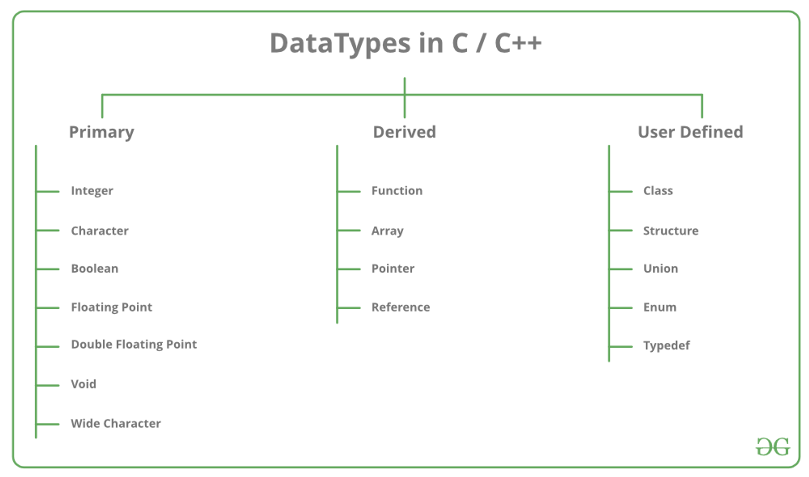
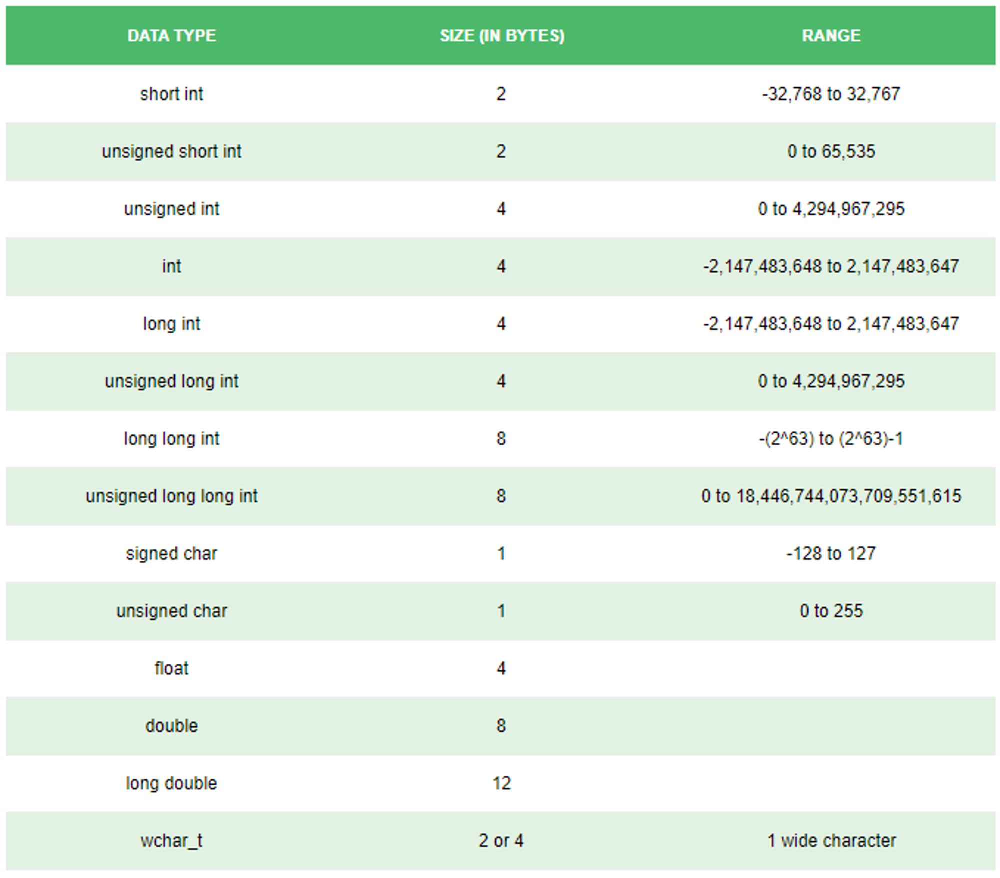

# C++ Part - 1

### Understanding basics of C++
``` c++
#include<iostream>

using namespace std;

int main() {
   cout<<"Hello World"<<endl;
   return 0;
}
```
Let's understand it ppart by part:
1. `#include<iostream>`:
    - This is how we import libraries in C++
    - Consider it same as import axios from "axios"
    - The general structure is `#include<library_name>`.
    - `iostream` is a library that imports the **I/O objects**. 

2. `using namespace std;`: 
    - In C++, a **namespace** is a collection of related **names** or **identifiers** **(functions, class, variables)** which helps to separate these identifiers from similar identifiers in other namespaces or the global namespace. 
    - Almost everytime, we will be using the std namespace only, so don’t worry about this a lot.

3. `int main()`: 
    - `main` function is the entry point for a file / program. 
    - `int` is the return type of the main method. 
    - Generally we will return `0` to indicate successful completion. 
    - We can also return error codes to indicate what kind of error occurred. However, in our case we will only return 0.

4. `cout`: 
    - Used for **printing the output to the terminal** (or some file). 
    - Similar to console.log() in Javascript

5. `endl`: 
    - Prints a new line after the output is printed. 
    - In C++, we need to manually specify newlines using endl or \n. 
    - For example: 
        ``` cpp
        cout<<"Hello ";
        cout<<"World";

        // Output: Hello World
        ```
6. `return 0;`: 
    - It returns `0` from the `main` function. 
 

### I/O Operations
#### Output

- For output, we can generally use `cout` statement.
    ```cpp
    cout << "Hello World!";
    ```
- To print new line we can use `endl` or `\n`.
- The difference between both are:
    - `\n`: It insert a new line to the output stream.
    - `endl`: It insert a new line and flushes the output stream.
- So eventually, `count << endl;` is equivalent to using `cout << '\n' << flush;`
- `\n` is much faster than `endl`, so use `\n` everytime if possible (unless you need to flush the output).
- When printing a single element or some fixed set of elements (like 100) we can use `endl`.

**Note:** By default, all streams (input and output) are tied together. Tied streams ensure that one stream is flushed automatically before each I/O operations on the other stream. To untie, we can use : `cout.tie(NULL);`

#### Input
- For reading input, we generally use `cin` statement.
    ``` cpp
    int x;
    cin >> x;

    // We can even read multiple space or newline seperated inputs like this

    int x, y;
    cin >> x >> y;
    ```

#### Fast I/O
Generally, the input and output streams are tied, which causes flushing before every I/O operation. This can make program execution slower in case of large input size. So, we can untie the streams adding the statements  `cin.tie(NULL)` and `cout.tie(NULL)` at the beginning of the program.

##### `std::ios_base::sync_with_studio` 
Sets weather the standard C++ streams are synchronized to the standard C stream after each I/O operation. In practice, the means that the synchronized C++ streams are unbuffered and each I/O operation on a c++ stream is immediately applied to the corresponding C stream's buffer. This makes it possible to freely mix C++ and I/O.

In addition, synchronized C++ streams are guaranted to be thread-safe (individual characters output from multiple threads may interleave, but no data races occur).

If the synchronization is turned off, the C++ standard streams are allowed to buffer their I/O independently, which may be considerably faster in some cases.

So overall, add these 2 things before the start of any program. 

Example:
``` cpp
#include<bits/stdc++.h>

using namespace std;

int main() {
  ios_base::sync_with_stdio(false);
  cin.tie(NULL);
  cout.tie(NULL);
  
  // Your program here
}
```


### Data Types in C++
C++ is a strictly types language. So, we need to specify the data type of all variables before assigning them values or using them. Generally, data types are categorised into 3 types: 
1. Primary / Bulit-in Data Types
2. Derived Data types
3. User Defined Data Types



#### Sizes of Primary Data Types


**Note:** Sizes of **derived** data types and **user defined** data types can be calculated from the size of **primary** data types. For example an integer array of length 8, will contain 8 integers. Each integer is 4 bytes. So the array size will be 8 * 4 bytes = 32 bytes

**Note:** The sizes (especially int and long long int) helps us identify which data type to use for inputs and calculations.


### Conditional statements in C++
C++ like Javascript has the following conditional statements:
1. **if else**
2. **switch**
3. **conditional operator**

#### if-else statements
``` cpp
if (condition_1) {
  // Executed if condition_1 is true
} else if (condition_2) {
  // Executed if condition_1 is false and condition_2 is true
} else {
  // Executed if both condition_1 and condition_2 are false
}
```
We can even have nested if else statements or just single if statement
``` cpp
// Only if statement
if (condition) {}

// Nested if else
if (condition_outer) {
   if (condition_inner) {}
   else {}
} else {}
```

#### switch statements
``` cpp
switch(variable) {
   case 1:
	   // When variable is 1
	   break;
	 case 2:
		 // When variable is 2
		 break;
	 default:
		 // When none of the case statements is satisfied
}
```
**Note:** The case value must be of type integer or character.
**Note:** 
Like Javascript, default statement is optional. Also break keywords are optional.


#### Conditional Operations
``` cpp
condition ? true_statement : false_statement
```
example:
``` cpp
bool is_even = (n % 2 == 0) ? true : false;

int absolute_diff = (a > b) ? a - b : b - a;
```