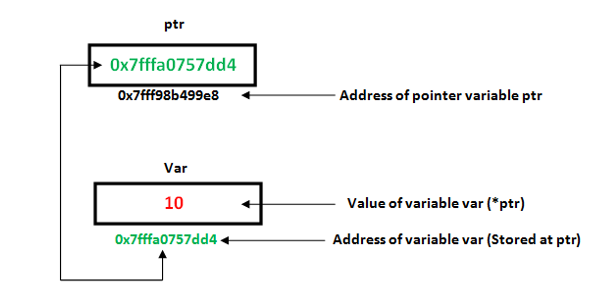

# C++ Part - 2

### String
- **Strings** is a collection of characters. 
- It is similar to arrays, but has more functionalities than arrays. 
- That means, all the array operations are valid on a string, but you have additional methods available as well.

``` cpp
#include<string> // Not needed if you are using bits/stdc++.h

using namespace std;

int main() {
   string s = "Hello World!";
   return 0;
}
```

#### Input and Output
- For String I/O, we can use `cin` and `cout` statements.
``` cpp
#include<iostream>
#include<string>

using namespace std;

int main() {
	string s;
	cin >> s;

	cout << "The string you entered is: " << s << endl;

	return 0;
}
```

#### Accessing characters
**String** eventually stores characters as an array. So like arrays, you can loop on the characters of string and access them by index. Or you can use the for-each loop as well.

``` cpp
for(int i = 0; i < s.length(); i++) {
   cout << s[i];
}

for(char x : s) {
   cout << x << " ";
}
```

#### Updating characters
Similar to arrays, we can update character at any index by `=` operator. Strings in C++ are **mutable** unlike some programming languages like Java, Python.

``` cpp
string s = "Hellw";
s[4] = 'o';
```

#### String Methods
Besides array-like operations, you can perform many other operations on Strings using some predefined methods. The following are examples of few commonly used ones:

``` cpp
string s = "Hello World";

// length
s.length();

// concatenation
string a = "Hello ", b = "World";
string res = a + b; // "Hello World"

// Equality
string a = "Test", b = "Test";
bool res = a == b; // true
a.compare(b); // = 0 if equal, < 0 is a is smaller, > 0 if a is larger

// Substring extraction
s.substr(1, 4); //ello, first argument is starting index and second is length

// Substring search
s.find("orl"); // First index where "orl" is present in string. If not found returns string::npos

// Replacing substring
s.replace(0, 3, "Hi"); // Replaces 3 characters from index 0 with "Hi"

// Inserting substring
s.insert(6, "new "); // Hello new World, Inserts the substring at index 6

// Iterators
s.begin() and s.end();

// Erase
s.erase(2, 3); // Erases 3 characters starting from index 2
s.erase(s.begin() + 1, s.begin() + 5); // Erases all characters in between indices [1, 5)
```

### Memory allocation
.png)
Generally any program that running needs memory, to store the variables. Whenever a program is running the variables might change so it needed to be stored somewhere. 
The memory (RAM) is categorised into 4 parts.
1. **Program Code:** This where the entire program code loaded.
2. **Global (Static):** Global variables are stored here.
3. **Stack:** Local Variables and Function calls are stored
4. **Heap:** Dynamic (Free) memory, this used for dynamic allocation.

- Statically declared arrays (i.e arrays whose size is fixed and known at compile time) are stored in Stack memory.
- Variables whose size is determined at run time i.e dynamic sized variables are stored in heap memory. For example, dynamic sized arrays are stored in heap memory.
- Basically, whatever is created at run time uses heap memory.
- The varable whose size are fixed and known at compile time are created in stack memory.


### Pointers
**Pointers** in C++ are variables that store memory addresses. They allow you to directly manipulate memory, which can be very powerful but also requires careful handling to avoid bugs like segmentation faults or memory leaks.


``` cpp
int x = 10; // We define an integer variable. It gets assigned 4 bytes in stack memory
int *ptr = &x; // We create a pointer on variable x. The pointer (ptr) stores the address of x
```

**Note:** `&` is the **addressOf** operator when used on the **right hand** of an` =` sign and can be used for defining references if used on left hand side or in function arguments. Similarly, `*` operator generally is used as valueOf operator except when it is declared with a data type in front of it, in that case it is for declaring a pointer variable.

**Note:**  In C++, references just means aliases (alternative name) to existing variables. They do not occupy any memory.

We can directly modify values of variables using pointers. For example: 
``` cpp
int x = 10;
int *ptr = &x; // We create a pointer on x
*ptr = 20; // Updates the value of x to 20.
```
Note, in the above e xample the usage of * operator. In the second line we have int *ptr = &x; . This tells us to create a pointer and assign it the value of address of variable x.

In Line 3, we write *ptr = 20 . As mentioned above, * without a data type before it is considered as valueOf operator. So it is read as Set valueOf variable pointed by pointer ptr (i.e x) to 20.


### Data type of pointer
Pointers themselves are always integers / longs as they hold memory location. They generally occupy a size of 8 bytes (or 4 bytes for 32-bit system).

However, we might see the different types of pointers are defined depending on the data type whose address it holds.

For example we define `int *ptr` for pointers holding address of integer variables. Similarly, we define `double *ptr` for pointers holding address of double variables. But the type of the pointer only signifies what is the data type of the variable whose address it holds and does not have anything to do with its memory allocation.

### Pointer of Pointer
It is a pointer to some pointer, i.e stores address of a variable which is a pointer.
``` cpp
int x = 10;
int *ptr = &x; // ptr stores address of x
int *ptr1 = &ptr; // ptr1 stores address of ptr
cout<< *ptr1; // Prints address of x
cout<< **ptr1; // Prints value of x
```

### Dynamic Allocation

#### Dynamic Arrays
One of the ways of creating a dynamic array is using pointers. Dynamic allocation allocates memory in the **heap** space. As we know a pointer hold the address of variable, if we can occupy the consective memory locations, we can use pointers to iterate on them ease.

The pointer holds the base address / first elements address. The type of the pointer determines the type of variable it points to. For example integer pointers are pointing to integer variables. So from that we know the memory of each variable uses(integer uses 4 bytes). So we can increment the base address by 4 bytes to get the address of the next element. This is called **pointer arithmetic**.

``` cpp
int *ptr;

// Let's say ptr stores 2000 which is address of a variable
// Data type of the variable is integer - 4 bytes

ptr++; // ptr becomes 2004 i.e address of the next element
ptr--; // ptr becomes 1996 i.e address of previous element
```

#### Create a dynamic array 
``` cpp
int *arr;
int n;
cin >> n;
arr = new int[n];

for (int i = 0; i < n; i++) {
   cin >> arr[i];
}
```
Let's understand what happens when we do `arr[i]`.
Internally, it translates into this: `arr[i] = *(arr + i)`

Now by pointer arithmetic, it should skip by the suze of the data types. So,
``` cpp
arr[i] = *(arr + i * sizeof(int))
```

The name of the array( i.e `arr`) holds the base address.


### Function Call Arguments
In C++, function call arguments are the values passed to a function when it's invoked. These arguments can be literals, variables, expressions, or even other function calls. When defining a function, you specify its parameters, which act as placeholders for the arguments that will be passed when the function is called.

Here's a basic example:
``` cpp
#include <iostream>

// Function definition with parameters
void printSum(int a, int b) {
    std::cout << "Sum is: " << (a + b) << std::endl;
}

int main() {
    int x = 5;
    int y = 3;

    // Function call with arguments
    printSum(x, y);

    return 0;
}
```

In this example:
- `printSum` is a function that takes two `int` parameters (`a` and `b`).
- In the `main` function, `x` and `y` are variables with values 5 and 3, respectively.
When `printSum(x, y)` is called, `x` and `y` are passed as arguments to `printSum`. These arguments are substituted for the parameters `a` and `b` within the function body.

In C++, there are three main ways to pass arguments to functions:
1. **Call By Value**
2. **Call By Pointer**
3. **Call By Reference**


#### Call By Value
``` cpp
int f(int x, int y) {
  x = 10;
  y = 20;
}

int a = 30;
int b = 40;

f(a, b);

cout<<a<<" "<< b; // Prints 30 40
```
The above code is an example of call by value approach. Here, 2 new variables x and y gets created. So when we change the value of x and y, it does not affect a and b.

**Note:** Whenever you use call by value, new variable is created. So be mindful of this especially during recursions.


#### Call By Pointer
``` cpp
int f(int *x, int *y) {
  *x = 10;
  *y = 20;
}

int a = 30, b = 40;
f(&a, &b);

cout<<a<<" "<<b; // Prints 10 20
```

Here, we are passing address of `a` and `b`. So x holds address of `a` and `y` holds address of `b`.
Now we are directly making the change in the address, so value of `a` and `b` are updated.


#### Call By Reference
``` cpp
int f(int &x, int &y) {
  x = 10;
  y = 20;
}

int a = 30, b = 40;
f(a, b);

cout<<a<<" "<<b; // Prints 10 20
```

The above code is an example of **call by reference** approach. As mentioned before, `&` means creating a **reference** which is an **alias / alternate name** for the variable. Here `x` and `y` just becomes **alternate names** for the variables `a` and `b` respectively. They don’t have any memory allocation of their own. So setting `x = 10` is equivalent to writing `a = 10`.


### Classes & Objects
C++ is an object oriented language. The 2 fundamental concepts are:
1. **Classes** - A class is a **blueprint** or **template** for creating objects. It defines the properties (**data members**) and behaviors (**member functions**) that objects of the class will have. Think of classes as user defined types.
2. **Objects** - An object is an **instance of a class**. It represents a specific realization of the class blueprint, with its own set of data members and methods

Example, consider you are building a Student management system. Now, for each student you want to store their name, roll no, address and CGPA. One approach is creating different lists for storing each of them. However, that makes things difficult to manage. The better approach is to create a type Student that holds all these values and also exposes methods that can mutate these values and perform certain operations for each student. This idea is called **Encapsulation**.

``` cpp
class Student {
   string name;
   string address;
   int roll_no;
   int attendance;
   float cgpa;
   
   public:
   void mark_attendance() {
		   this.attendance += 1;
   }
}

Student ram = new Student();
```

#### this keyword
`this` keyword is used inside a class, that is used to represent the instance of the class calling the method. For example, if we have 2 students, Ram and Shyam and we call `ram.mark_attendance()` then `this` keyword represents the object ram.


#### Constructors
**Constructors** are the first method that is called when an object of the class is created. It is for assigning initial values to the data members. There are 3 types of constructors:
1. **Default Constructor**: This is by default present, even if we don't manually define a constructor. It does not take any arguments and assigns default values to data members.
2. **Parameterised Constructor**:  This takes paramenters of the initial values and assigns the data members these values.
3. **Copy Constructor**: Copies the data member initial values from another object.

``` cpp
class Student {
   string name;
   string address;
   int roll_no;
   int attendance;
   float cgpa;
   
   public:
   // default constructor
   Student() {
      this.name = "";
      this.address = "";
      this.roll_no = 0;
      this.attendance = 0;
      this.cgpa = 0.0;
   }
   
   // Parameterised constructor
   Student(string name, string address, int roll, float cgpa) {
	   this.name = name;
	   this.address = address;
	   this.roll_no = roll;
	   this.attendance = 0;
	   this.cgpa = cgpa;
   }
   
   // Copy constructor
   Student(Student &s) {
	   this.name = s.name;
	   this.address = s.address;
	   this.roll_no = s.roll_no;
	   this.attendance = 0;
	   this.cgpa = s.cgpa;
   }
   
   void mark_attendance() {
		   this.attendance += 1;
   }
}
```