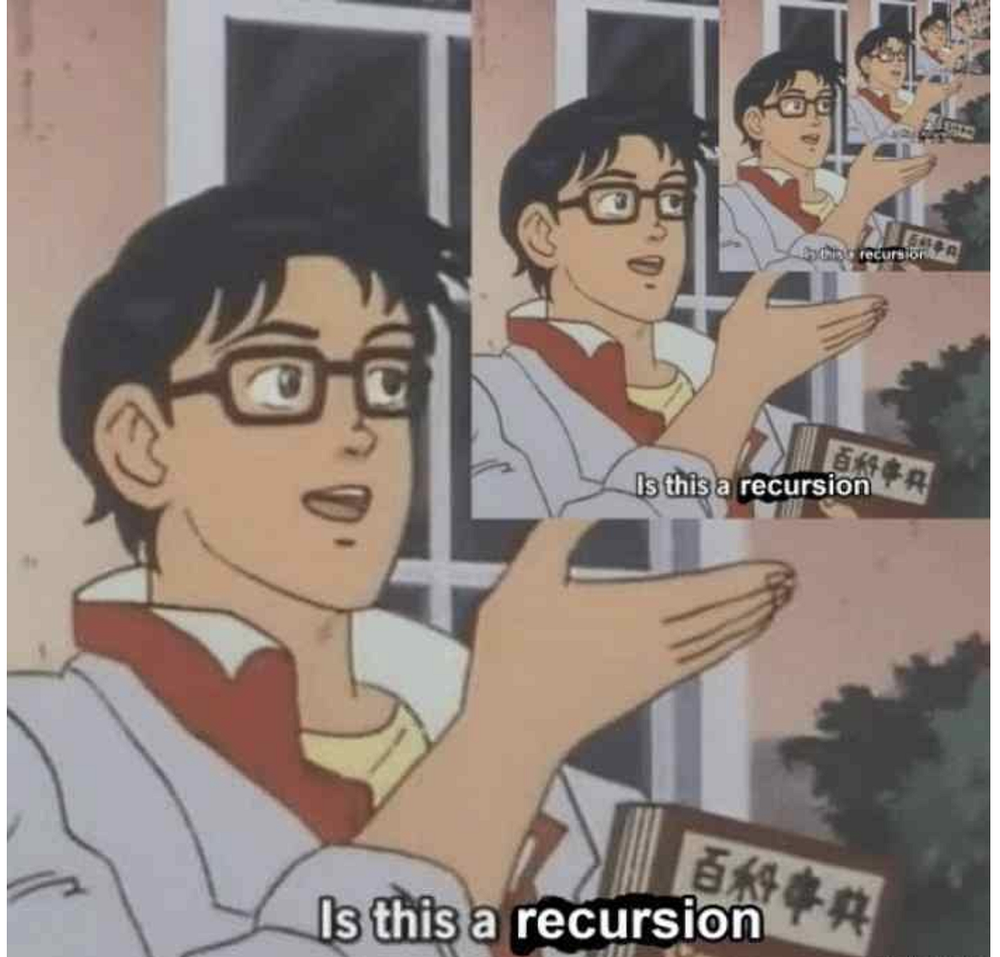
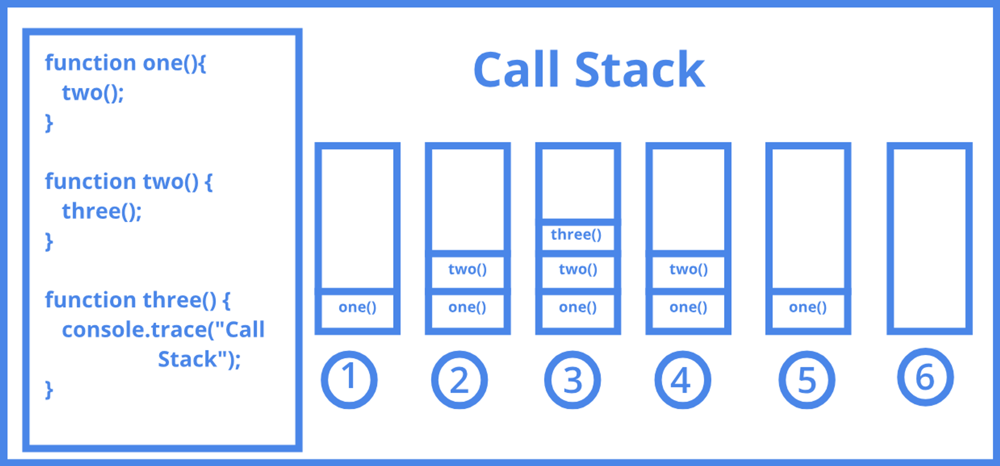

# Recursion: Part 1

### Introduction to Recursion

#### What is Recursion?

- A function calling itself (with different parameters) is called recursion.
- For example: f(n) = f(n-1) + f(n-2) is an example of recursion.

#### Visual Representation (Recursion Tree)
```
            fib(6)
           /      \
      fib(5)        fib(4)
      /     \       /     \
  fib(4)  fib(3) fib(3) fib(2)
  /     \
fib(3) fib(2)
```

``` cpp
int fib(int n) {
    if (n == 1 || n == 0) return n;
    
    return fib(n - 1) + fib(n - 2);
}
```

#### Function Call Stack


#### Structure of a recursive function
1. **State:** States are the function parameters that change during the recursion. For example, in the case of Fibonacci numbers `fib(n)`, `n` is the state as it changes during every recursive call.
2. **Base condition:** These are very important to terminate a recursion. Otherwise, the recursion would continue infinitely leading to stack size limit exceeded errors. A base condition is hardcoding the answer for some values of the state (generally smaller values) which we can calculate manually.
3. **Transition:** We can call it a subproblem, recursive call, or transition. It is basically how a state depends on other states to calculate its value.  Or, calling the next states from the current state.

### Complexity Analysis
``` cpp
                                     fib(n)                               -> 2^0
                                 /           \
                              fib(n-1)         fib(n-2)                   -> 2^1
                             /      \          /       \
                        fib(n-2)    fib(n-3)  fib(n-3)   fib(n-4)         -> 2^2
                        .
                        .
                        .
            fib(0)    fib(1)    fib(0)    fib(1)   fib(0)    fib(1) ...    -> 2^n         
```