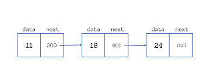

# Linked List

### Introduction to Linked List

**Linked List** is a **linear data structure**, similar to arrays. The major difference is, in linked list, the elements are not next to each other in memory like that in arrays. In array, the elements occupy a continuous block of memory, whereas in linked list, the elements do not occupy consecutive blocks. As a result, we cannot use indices in linked list. Each element (we call it a node of a linked list) holds the address (or reference) to the next node. 



Each element (or node) in a linked list holds at least 2 values:
    1. The Data to be stored
    2. Pointer to the next node

Two Important nodes of a linked list are:
1. **Head:** The head is a pointer to the first node of a linked list. We begin our iteration from this node. Generally in every linked list, head node will be given
2. **Tail:** The tail is a pointer to the last node of a linked list. This is optional 

### Creating a Linked List

First let’s define a class that describes a Node. Let’s say each element holds an integer value.

``` cpp
class Node {
    int data;
    Node *next;

    public:
        Node() {
            this->data = 0;
            this->next = NULL;
        }

        Node(int v, Node *next) {
            this->data = v;
            this->next = next;
        }
};
```

Now let’s write a method that adds a node at the end of the linked list.
``` cpp
Node* addAtEnd(Node *head, Node newElement) {
   if (head == NULL) {
     // If head is NULL. It means the linked list is empty
     head = &newElement;
   } else {
	   Node *curr = head;
	   while(curr->next != NULL) {
		    //next is NULL only for the last node
	      curr = curr->next;
	   }
	   
	   curr->next = &newElement;
   }
   
   return head;
}
```

### Iterating in a linked list
To iterate in a linked list, we can start at the head node and go as long as we don’t reach the last node. The last node is identified using `node.next == NULL`.

``` cpp
Node *curr = head;
while (curr != NULL) {
  // Do something with curr node
  curr = curr->next;
}
```

### Operations on a linked list
#### Add a node at beginning
``` cpp
Node* addNodeAtBegining(Node* head, int data) {
    Node *node = new Node(data, head);
    head = node;

    return head;
}
```

#### Removing node from beginning
``` cpp
int removeNodeAtBeginning(Node *head) {
    Node *current = head;
    head = head.next;

    int data = current->data;

    delete current;

    return data;
}
```

#### Removing from end
``` cpp
int removeNodeFromEnd(Node *head) {
    Node *current = head;
    Node *previous = null;
    
    while(current->next != NULL) {
        previous = current;
        current = current->next;
    }

    previous->next = NULL;
    const data = current->next;
    delete current;
    
    return data;
}
```

#### Removing a random node
``` cpp
Node *deleteNode(Node *head, int k)
{
    Node *current = head;

    if (head->data == k)
    {
        head = head->next;
        delete current;

        return head;
    }

    Node *previous = NULL;

    while (current != NULL)
    {
        if (current->data == k)
        {
            previous->next = current->next;
            delete current;

            return head;
        }

        previous = current;
        current = current->next;
    }

    return head;
}
```